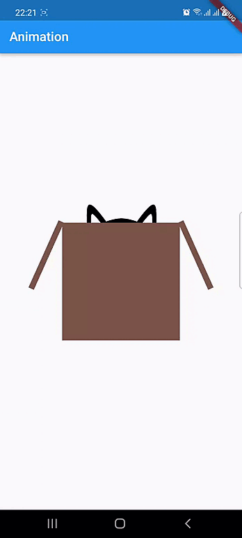

# animation_app

A new Flutter project.

## Getting Started

Used Animation, AnimationController, Tween and AnimationBuilder for the cat and box animation.
Used Stack and Positioned for the layout
Used Transform.rotate for the rotated flaps
Used Image.network() for the cat png.

